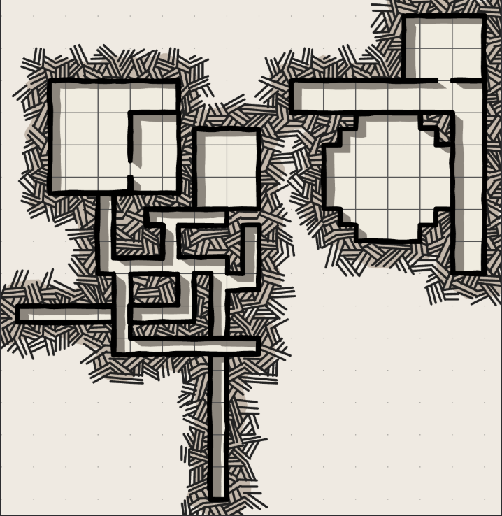

# Flucht
## Selwyn Harpell
Magier in Ausbildung; sympathisiert mit den Gefangenen; sitzt in der Aservatenkammer. Wenn freundlich: gibt hinweis auf Eingang in die Abwasserkanäle.

# Routen
## Süden nach Triboar
### Quests

- Karawane verschwunden; In einen Graben gestürzt, Verletzte
- Banditengruppe hat sich im Wald außerhalb der Reichweite der Stadt niedergelassen:
  - Karawanen-Eskorte
  - oder vertreiben der Gruppe
- Wolfsrudel reißt Vieh
- Eskorte; sofortiger Aufbruch; Flucht von Lady Isolde Veyne vor Zwangsheirat nach Neverwinter

## Westen
### Werwolfclan

**Grimmauld "Grim" Bidderdoo**

Anführer des Werwolfclans; Streng, aber gütig; Verpflegt die Gruppe kurzzeitig und wird bei guter Beziehung dauerhafter Freund

**Quest**

- Sammeln von Kräutern für Vollmondopfer an Selune
- Malar-Anhänger plant Überfall auf das Dorf, was das angespannte Verhältnis verschlechtern könnte

### Neverwinter Forest

- Überlebens- und Orientierungschecks
- Außenposten des Cragmaw-Hideouts am Waldrand

### Neverwinter

- Bringt ein buch nach Waterdeep
- Festspiel: Wer die meisten Wölfe tötet
- Ratten im Keller
- Adelige eskortieren Quest aus Triboar, nur umgekehrt.

## Osten
### Grethel Weidenbein

Hexe; lebt auf Respektbasis zusammen mit Naturgeistern; riecht nach Kräutern.

### Quests

- Botenfrösche sind verschwunden, waren auf dem Weg zum Calling Horns
- Crazed Giant Toad (Toad: INI +2; HP: 8d6+6) frisst Wanderer und Sumpfbewohner; gruppe soll ihn beruhigen und die Ursache finden: Giftköder für Wölfe; Gegengift brauen lassen und dann nachricht an Tamalin Zoar über verbot dieser Köder

### Calling Horns

**Quests**

- In letzter zeit sind in der ganzen Stadt überfälle durchgeführt worden, immer da und dann wo die sich ändernden Routen der Deputies gerade lücken lassen.
- Einem Bauern sind bei einem Trollangriff die Ziegen weggelaufen, sucht sie im Sumpf
- Escortiert einen Händler nach Triboar (folgequest für Rückweg)

# Encounter 
|Mob|Easy|Medium|Hard|
|-|-|-|-|
Bandit
Bandit-Captain
Orc
Orog
