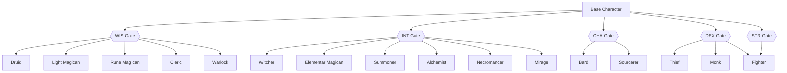

This is meant as an overview on classes and races and some discussions on those topics.

# Races:

# Classes:

## Magicans

### Not used magic types

- Diviners
    - Cartomancy
    - Chiromancy
    - Ornithomancy
    - Ostemancy
    - Sonomancy

- Umbramancy 

### Elementar magican

#### Pyromancer

- Uses fire for magic. 
- Can manipulate fire.

#### Hydromancer 

- Uses water for magic. 
- Can manipulate water.

#### Geomancer

- Uses earth for magic. 
- Can manipulate solids and grounds.

#### Aeromancer

- Uses air for magic. 
- Can manipulate wind and it's flow.

### Light magic

#### Solar magican

- Uses Magic and Energy of sun

#### Luna magican

- Uses magic and Energy of moon

### Rune magican

- Uses Nordic Runes to cast spells and buffs

### Alchemists

- Uses idea of transformation magic. 
- Is building golems.

### Summoners

- Is summoning different demons. It defers from Warlock, as warlock got a patreon and summoner is summoning different demons and imperats them.

### Mirages

- Creates Illusions and manipulates the mind of the enemy

### Necromancer

- Is rewakening deaths and creating golems of meat and flesh.

### Druid

- Uses magic about plants and animals.
- Can use a lot of Elementar magic

### Witcher

- Uses courses and brews potions. Uses blood magic as well.

> Even if there are a lot of class bound spells, but I am a fan of many free usable spells to differ a little more.

## Class Tree

The idea is to have some more variance in classing by opening to only lose a very tiny bit of progress.

You start on choosing a main path in tree. You unlock it by reaching certain attribute levels.

After it you can enter specific classes. If you go for DEX you could become a Ranger or a Fighter or a Thief of course.