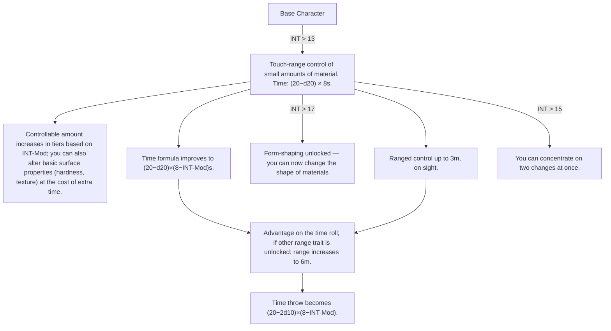

# Core idea

Your Character gains 1 Traitpoint per Level, so you start at 1 Point. You can spend those Traitpoints at any time into any trait you match the requirements for.

# Traits and connected lore 

> Notice this lore/fantasy is just what I originally intended for this path to be. Of course, you can adjust the traits to change the fantasy as well. But speak about this to your DM.

> Even if those Traits still are grouped into classes, you can freely swap between those. The classes only exist for classification and to reduce writing.

---

> ## Explanation about the Flowcharts:
>
> If an Arrow is pointing from one to another you need to gain that one first thatone the arrow is pointing from. If there are multiple Arrows pointing to one you need to have all of the sources. If there are exceptions it is written down.
>
> Attribut-Gates are written on arrows.

##  Alchemist

### State
*Matter never stand still. The constant moving makes it only seam still and solid. But change the speed a little it all breaks apart: Stone becomes liquid and air hard as a rock. As alchemist, you can control that movement to mave impact on world around you.*

flowchart TD
A[Base Character]



### Golem mancer

*Clay does not dream, and iron does not care. But give either a purpose precise enough, and it will pursue that purpose with a devotion no living servant could match. You are a maker of obedient bodies — vessels shaped by hand and bound by rite, animated by a spark of will that is yours to command. A golem asks no wages, feels no fear, and never once questions the order it was given.*

```mermaid
flowchart TD

A[Base Character]

1[Perform a ritual to build golems from a shapeable material (clay, mainly). Shaping takes (max(1, Size-Tier − INT-Mod))×(6−1d6) turns. Each golem needs a reusable animating spell (in it's body), which you know and can inscribe on any material.]
2[Sacrifice golem HP to reduce build time to max(1, Size-Tier − INT-Mod).]
3[Build more complex golems (better base stats and features).]
4[Golems understand chains of instructions.]
5[Choose a combat specialization for your golems (guardian, brawler, or carrier) granting relevant combat traits.]
6[Increase the maximum number of golems you can control simultaneously.]
7[Golems learn to coordinate and execute tasks together as a unit.]
8[Advantage on all building throws. There is no cap on the number of golems you can field.]

A-->|INT > 10|1

---

## Part C — Bard

### Bard · Awakening Stories
*Words were the first magic, long before anyone called it that. A story told with total conviction — every detail true, every stake real — does not merely describe the world; for a moment, it becomes it. You are a teller of tales that refuse to stay fiction, weaving belief itself into a blade. But magic this old demands honesty as its price: lie without mastery, and the world simply declines to listen.*

### Bard · Battle Music
*Sound moves the body before the mind agrees to be moved. A lullaby slows a racing heart; a war-drum quickens a fearful one. You have learned to play not for the ear, but for the blood — songs that steady an ally's nerve or curdle an enemy's courage, rhythms that numb pain or summon it. Where others carry weapons, you carry a melody, and on the right battlefield, that is worse.*

---

## Part D — Druid

*Every Druid path below is, at its heart, a conversation — with beast, root, blood, or spirit. None of it is domination; all of it is persuasion. Nothing in nature knowingly harms itself, and a Druid who forgets that distinction stops being a Druid at all.*

### Druid · Animals
*You did not tame the wild — you learned its language, and it decided to trust you. Every growl, chirp, and silence carries meaning to those patient enough to listen, and you have listened long enough to answer back. A beast that follows your word is not obeying a master; it is honoring an understanding, one creature to another, that happens to run deeper than most humans ever bother to build.*

### Druid · Plants
*Roots remember everything the soil has ever told them, and a Druid who learns to listen through touch can borrow that patience for a moment's purpose. You do not command the green — you lend it strength it did not know it wanted to spend, and it repays the favor in ways no blade or spell can match. Slow, ancient, and vast beneath the surface, the plant world moves at your request only because you have never once asked it to hurt itself.*

### Druid · Earth/Life
*Life is not a possession — it is a current, flowing through every breathing thing, and you have learned to feel its pulse beneath your palm. To heal is to steady that current; to draw from it is to borrow against something no creature freely gives away. This is the oldest and most dangerous of the Druid's gifts, for the line between mending and taking is thinner than most who walk it ever admit.*

### Druid · Nature Spirits
*Before there were gods with names and temples, there were presences in the wood that noticed when you passed through uninvited. You have learned to notice them back — first as a feeling of being watched, later as voices with opinions, favors, and grudges of their own. They are not servants and never will be; they are neighbors older than memory, and a wise Druid treats every favor earned as a debt eventually owed.*

---

## Part E — Elementalist

*Fire, water, earth, and air answer to the same principle, worn in four different shapes: mass, complexity, reach, and resistance. You do not conjure the elements from nothing — you convince what is already there to move, burn, flow, or hold in the shape your will describes. The four paths below are less separate disciplines than four dialects of the same argument with the world.*

### Elementalist · Fire
*Fire has always wanted to spread — you have simply learned to ask it where. What begins as a candle's flicker under your fingertip grows, with study, into a blaze that recognizes you as kin and spares you its hunger. Others fear what burns; you have made peace with it, on the condition that it remembers, always, whose fire it is.*

### Elementalist · Water
*Water does not fight — it finds the way around, beneath, or through, patient and relentless in equal measure. You have learned to be that patience made purposeful: currents that answer your intent, floods that rise where you point, mist that gathers because you willed it to. Stone breaks. Water simply continues, and so, increasingly, do you.*

### Elementalist · Earth
*The ground does not move quickly, but it moves absolutely when it finally does. You are the one who convinces stone and soil that stillness was only ever a habit, not a law — raising walls from bare earth, shaking foundations with a thought, and eventually feeling the whole world tremble beneath you like an extension of your own skin.*

### Elementalist · Air
*Nobody notices the wind until it chooses to matter. You are the reason it chooses — a breath that turns into a gust, a gust that turns into a gale precise enough to snuff a single candle across a room or knock a single man off his feet. Air asks for nothing and holds nothing back; it simply goes where you tell it, faster than anyone expects.*

---

## Part F — Fighter

*Every warrior burns something to fight harder — breath, focus, fear turned inside out. You call it adrenaline: the body's oldest magic, no spellbook required. Three paths, three different relationships with that fire — one who lets it consume him, one who rides it like a blade's edge, one who banks it like a hearth for others to stand near.*

### Fighter · Barbarian (STR)
*Rage is not a loss of control — it is a different kind of control, one that trades precision for certainty. Something in you answers pain and violence not with retreat but with more of the same, building until it must be spent. You do not fight to survive the moment. You fight because the moment has finally given you a reason to stop holding back.*

### Fighter · Duelist (DEX)
*A blade fight is a conversation held at speed, and you have learned to listen to your own body's rising pulse as closely as your opponent's footwork. Every parry, every near-miss, feeds something coiled and ready beneath your calm — and when it finally breaks loose, it does not make you reckless. It makes you exact.*

### Fighter · Knight (CON)
*Some warriors fight to win. You fight to make sure everyone beside you gets to keep fighting too. Every blow you take, every hit you turn aside for someone who couldn't, builds a steadiness in you that has nothing to do with anger and everything to do with resolve. The line holds because you decided, a long time ago, that it would.*

---

## Part G — Light Mage

*Light does not belong to you, and it never will — it belongs to the sun, the moon, and whatever source you happen to be standing beneath. Cut off from that source, you are only as strong as anyone else in the dark. But given light, even a little, you become something the dark has learned to fear.*

### Light Mage · Sun-Worker
*The sun asks nothing in return for its warmth, and you have learned to shape that gift into something with an edge. Your weapon is light given form and purpose, reforged in ritual beneath open sky, burning steady and honest in a way that shadow-born magic never quite manages. There is no trickery in what you do — only brilliance, focused.*

### Light Mage · Moon-Worker
*The moon is not the sun's lesser reflection — it is its own thing entirely, changeable, patient, and just a little unkind to those who cross it. You have learned to work with that change rather than against it, shaping a weapon whose nature shifts with the sky itself. Where the Sun-Worker is a steady flame, you are a phase — sometimes radiant, sometimes something closer to shadow wearing light's shape.*

---

## Part H — Mirage

*Nothing you make is real, and that has never once stopped it from hurting someone. You are an architect of belief, building illusions so convincing that the line between seeing and knowing simply stops mattering to the mind you're speaking to.*

### Mirage · Mind Reader
*Every person carries a fear and a want close enough to the surface that a careful glance can find it. You have learned to read that surface and hand it back to them, twisted into something they cannot look away from. It is not mind control — it is worse. It is showing someone exactly what they were already afraid of, or already wanted, and letting their own mind do the rest.*

### Mirage · Fata Morgana
*The world lies to itself all the time — a mirage on the horizon, a trick of heat and light that fools even careful eyes. You have learned to author those lies on purpose, bending light until the ground cracks that was never cracked, until a wall stands that was never built. You cannot make a bird fly or a beast attack; you can only make the world around them look different than it is — which, against the right mind, is more than enough.*

---

## Part I — Monk

*Discipline is its own kind of power, refined through repetition until the body stops needing to think and simply acts. Two paths, one root: the Ki Adept who bends inner energy into stances and technique, and the Martial Artist who needs nothing but flesh, bone, and years of relentless practice.*

### Monk · Ki Adept
*Somewhere beneath breath and muscle lies a current most people never learn to touch. You have touched it, shaped it, and folded it into stances — postures that are not merely positions but promises of what your body is about to become. Ki spent is ki earned back, cycle after cycle, as long as your strikes land true.*

### Monk · Martial Artist
*You needed no current, no pool, no spark of hidden energy — only time, repetition, and the refusal to stop training past the point where others quit. Your body is the weapon, honed by nothing but discipline, and it shows: every strike a little faster, every reflex a little sharper, until "unarmed" stops meaning "unarmed" to anyone who has felt your hands land.*

---

## Part J — Necromancer

*Death is not an ending you fear — it is a resource you understand better than most of the living ever will. Two paths: one that spends the caster's own vitality as currency, one that commands what vitality has already left behind.*

### Necromancer · Blood
*Every spell has a price, and you have simply chosen to pay it yourself, in the oldest coin there is. A cut, a toll, a sacrifice — your own blood spent to push your magic further than it would otherwise reach. Others fear the cost. You have made peace with it, because you were always going to be the one paying either way.*

### Necromancer · Death
*A corpse is not nothing — it is a vessel that stopped being used, and you have learned to put it back to work. Quality matters as much as quantity: a fresh, strong body answers your command with more strength than a decade-old bone, but given time and skill, you can raise a small army from what everyone else considers simply gone.*

---

## Part K — Cleric / Paladin

### Cleric · Fateful
*Your power is not entirely your own — it is lent, channeled from a deity or an oath sworn deeply enough to answer back. Every time you call on it, you are reminded that faith is not passive; it is a working relationship, renewed each time you ask for its strength and each time that strength is granted.*

---

## Part L — Sorcerer

### Sorcerer · Channeler
*Magic was never meant to be tame, and you have never quite managed to fully leash it. Every spell you cast is a negotiation with forces that don't much care what you intended — sometimes they cooperate exactly, sometimes they overshoot wildly, and sometimes the difference between the two is the most interesting thing that happens all fight. You do not control wild magic. You survive it, more skillfully each time.*

---

## Part M — Summoner

*A demon's true name is a key, and finding it is only the first danger. Binding one is a negotiation held at the edge of a blade; keeping it bound is a discipline that never fully ends. Two paths: command many weak servants, or dominate one terrible one.*

### Summoner · Quantity
*One demon bound is a risk. A dozen is a small war, held together by your will alone. You have chosen breadth over depth — command over dominance — building a horde one desperate ritual at a time, each new binding making the whole a little harder to hold and a little more dangerous to face.*

### Summoner · Quality/Strength
*You do not want an army of weak things. You want one thing strong enough that an army wouldn't matter. Every ritual you perform digs deeper into names better left unspoken, seeking out power worth the risk of binding it — and once bound, you do not merely command it. You break its will, piece by piece, until it serves you not from fear alone, but from something closer to submission.*

---

## Part N — Warlock

### Warlock · Overall Track
*You made a bargain, and bargains have a way of reshaping the one who makes them. Your patron — fiend, fey, or something with no comfortable name at all — grants power in exchange for a devotion that only deepens with time. Every prayer answered is a debt quietly renewed, and every gift given comes wearing its patron's fingerprints, whether you notice them or not.*

---

## Part O — Witch

*A Witch's power is old, personal, and built on knowing things others don't — a true name, a stolen strand of hair, the exact shape of a grudge. Four paths, one instinct: the world can be bent, if you know precisely where to press.*

### Witch · Curses & Witchcraft
*A curse spoken at a stranger is a threat. A curse spoken by name, over something they once owned, with their face fixed in your memory — that is a promise. You have learned that misfortune is not random; it can be aimed, layered, and made to land exactly where you intend, and the more of a person you hold in your grasp, the less that person's luck belongs to them at all.*

### Witch · Brewing
*Every plant, root, and rare ingredient holds a secret it's willing to give up to someone patient enough to ask correctly. You are a keeper of recipes half-remembered and half-discovered — potions that heal, harm, hinder, or help, bottled from patience and precision in equal measure. A cauldron does not lie, if you know how to read what it tells you.*

### Witch · Familiar
*A familiar is not a pet, and it was never meant to be decorative. Bound to you by something closer to kinship than command, it fights at your side, watches when you cannot, and feels what you feel across a distance neither of you fully understands. Lose it, and you lose part of yourself. Most Witches would tell you that risk was always the point.*

### Witch · Fate & Foresight
*The future is not fixed, but it leans — and you have learned to feel which way. A glimpse here, a nudge there: not command over fate, but a whispered suggestion to a world that mostly listens. You do not force outcomes. You simply learn, a little before anyone else, which way they were already about to fall — and sometimes, that's enough to matter.*
