# Core idea

Your Character gains 1 Traitpoint per Level, so you start at 1 Point. You can spend those Traitpoints at any time into any trait you match the requirements for.

# Traits and connected lore 

> Notice this lore/fantasy is just what I originally intended for this path to be. Of course, you can adjust the traits to change the fantasy as well. But speak about this to your DM.

> Even if those Traits still are grouped into classes, you can freely swap between those. The classes only exist for classification and to reduce writing.

---

> ## Explanation about the Flowcharts:
>
> If an Arrow is pointing from one to another you need to gain that one first thatone the arrow is pointing from. If there are multiple Arrows pointing to one you need to have all of the sources. If there are exceptions there is no arrow, but a normal line.
>
> Attribut-Gates are written on arrows.

##  Alchemist

### State
*Matter never stand still. The constant moving makes it only seam still and solid. But change the speed a little it all breaks apart: Stone becomes liquid and air hard as a rock. As alchemist, you can control that movement to mave impact on world around you.*

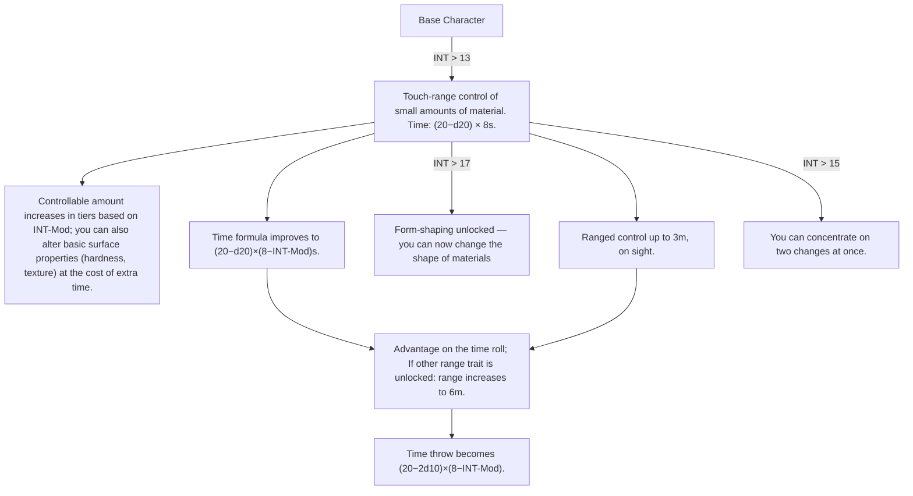
```mermaid
flowchart TD

A[Base Character]

1["Touch-range control of small amounts of material. Time: (20−d20) × 8s."]
2["Controllable amount increases in tiers based on INT-Mod; you can also alter basic surface properties (hardness, texture) at the cost of extra time."]
3["Time formula improves to (20−d20)×(8−INT-Mod)s."]
4["Form-shaping unlocked — you can now change the shape of materials"]
5["Ranged control up to 3m, on sight."]
6["Advantage on the time roll; If other range trait is unlocked: range increases to 6m."]
7["You can concentrate on two changes at once."]
8["Time throw becomes (20−2d10)×(8−INT-Mod)."]

A -->|INT > 13| 1
1 --> 2
1 --> 3 --> 6 --> 8
1 --> 5 --> 6
1 -->|INT > 17| 4
1 -->|INT > 15| 7
```

### Golem mancer

*Clay does not dream, and iron does not care. But give either a purpose precise enough, and it will pursue that purpose with a devotion no living servant could match. You are a maker of obedient bodies — vessels shaped by hand and bound by rite, animated by a spark of will that is yours to command. A golem asks no wages, feels no fear, and never once questions the order it was given.*

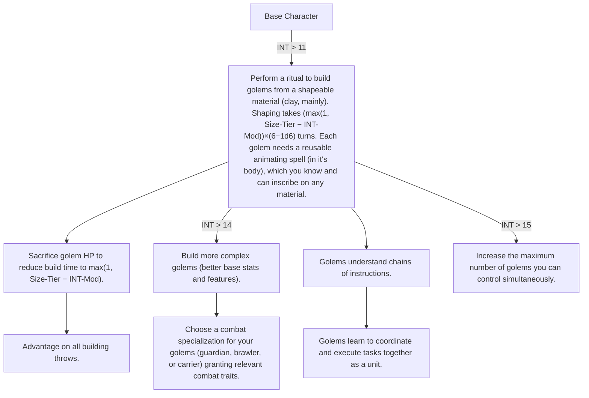
```mermaid
flowchart TD

A[Base Character]

1["Perform a ritual to build golems from a shapeable material (clay, mainly). Shaping takes (max(1, Size-Tier − INT-Mod))×(6−1d6) turns. Each golem needs a reusable animating spell (in it's body), which you know and can inscribe on any material."]
2["Sacrifice golem HP to reduce build time to max(1, Size-Tier − INT-Mod)."]
3["Build more complex golems (better base stats and features)."]
4["Golems understand chains of instructions."]
5["Choose a combat specialization for your golems (guardian, brawler, or carrier) granting relevant combat traits."]
6["Increase the maximum number of golems you can control simultaneously."]
7["Golems learn to coordinate and execute tasks together as a unit."]
8["Advantage on all building throws."]

A -->|INT > 11|1
1 --> 2 --> 8
1 --> |INT > 14| 3
1 --> 4 --> 7
3 --> 5
1 --> |INT > 15| 6
```

---

## Bard

### Bard · Awakening Stories
*Words were the first magic, long before anyone called it that. A story told with total conviction — every detail true, every stake real — does not merely describe the world; for a moment, it becomes it. You are a teller of tales that refuse to stay tales, weaving belief itself into a blade.*

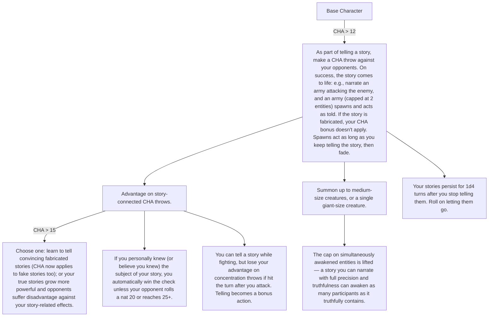
```mermaid
flowchart TD

A[Base Character]

1["As part of telling a story, make a CHA throw against your opponents. On success, the story comes to life: e.g., narrate an army attacking the enemy, and an army (capped at 2 entities) spawns and acts as told. If the story is fabricated, your CHA bonus doesn't apply. Spawns act as long as you keep telling the story, then fade."]
2["Advantage on story-connected CHA throws."]
3["Summon up to medium-size creatures, or a single giant-size creature."]
4["Choose one: learn to tell convincing fabricated stories (CHA now applies to fake stories too); or your true stories grow more powerful and opponents suffer disadvantage against your story-related effects."]
5["Your stories persist for 1d4 turns after you stop telling them. Roll on letting them go."]
6["If you personally knew (or believe you knew) the subject of your story, you automatically win the check unless your opponent rolls a nat 20 or reaches 25+."]
7["You can tell a story while fighting, but lose your advantage on concentration throws if hit the turn after you attack. Telling becomes a bonus action."]
8["The cap on simultaneously awakened entities is lifted — a story you can narrate with full precision and truthfulness can awaken as many participants as it truthfully contains."]

A --> |CHA > 12|1
1 --> 2 --> |CHA > 15|4
1 --> 3
1 --> 5
2 --> 6
2 --> 7
3 --> 8
```

### Bard · Battle Music
*Sound moves the body before the mind agrees to be moved. A lullaby slows a racing heart; a war-drum quickens a fearful one. You have learned to play not for the ear, but for the blood — songs that steady an ally's nerve or curdle an enemy's courage, rhythms that numb pain or summon it. Where others carry weapons, you carry a melody, and on the right battlefield, that is worse.*

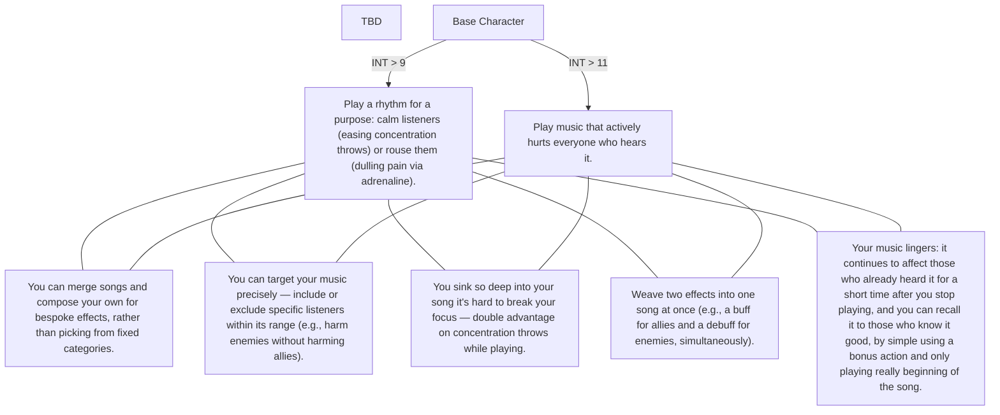
```mermaid
flowchart TD

A[Base Character]

1["Play a rhythm for a purpose: calm listeners (easing concentration throws) or rouse them (dulling pain via adrenaline)."]
2["Play music that actively hurts everyone who hears it."]
3["TBD"]
4["You can merge songs and compose your own for bespoke effects, rather than picking from fixed categories."]
5["You can target your music precisely — include or exclude specific listeners within its range (e.g., harm enemies without harming allies)."]
6["You sink so deep into your song it's hard to break your focus — double advantage on concentration throws while playing."]
7["Weave two effects into one song at once (e.g., a buff for allies and a debuff for enemies, simultaneously)."]
8["Your music lingers: it continues to affect those who already heard it for a short time after you stop playing, and you can recall it to those who know it good, by simple using a bonus action and only playing really beginning of the song."]

A --> |INT > 9| 1  --- 4 
A --> |INT > 11| 2 --- 4
1 --- 5
2 --- 5
1 --- 6
2 --- 6
1 --- 7
2 --- 7
1 --- 8
2 --- 8
```

---

## Druid

*Every Druid path below is, at its heart, a conversation — with beast, root, blood, or spirit. None of it is domination; all of it is persuasion. Nothing in nature knowingly harms itself, and a Druid who forgets that distinction stops being a Druid at all.*

### Druid · Animals
*You did not tame the wild — you learned its language, and it decided to trust you. Every growl, chirp, and silence carries meaning to those patient enough to listen, and you have listened long enough to answer back. A beast that follows your word is not obeying a master; it is honoring an understanding, one creature to another, that happens to run deeper than most humans ever bother to build.*

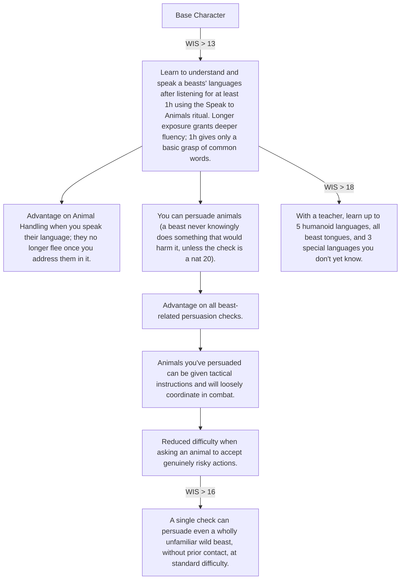
```mermaid
flowchart TD

A[Base Character]

1["Learn to understand and speak a beasts' languages after listening for at least 1h using the Speak to Animals ritual. Longer exposure grants deeper fluency; 1h gives only a basic grasp of common words."]
2["Advantage on Animal Handling when you speak their language; they no longer flee once you address them in it."]
3["You can persuade animals (a beast never knowingly does something that would harm it, unless the check is a nat 20)."]
4["With a teacher, learn up to 5 humanoid languages, all beast tongues, and 3 special languages you don't yet know."]
5["Advantage on all beast-related persuasion checks."]
6["Animals you've persuaded can be given tactical instructions and will loosely coordinate in combat."]
7["Reduced difficulty when asking an animal to accept genuinely risky actions."]
8["A single check can persuade even a wholly unfamiliar wild beast, without prior contact, at standard difficulty."]

A -->|WIS > 13|1
1 --> 2 
1 --> 3 --> 5 --> 6 --> 7 -->|WIS > 16|8
1 --> |WIS > 18|4
```

### Druid · Plants
*Roots remember everything the soil has ever told them, and a Druid who learns to listen through touch can borrow that patience for a moment's purpose. You do not command the green — you lend it strength it did not know it wanted to spend, and it repays the favor in ways no blade or spell can match. Slow, ancient, and vast beneath the surface, the plant world moves at your request only because you have never once asked it to hurt itself.*

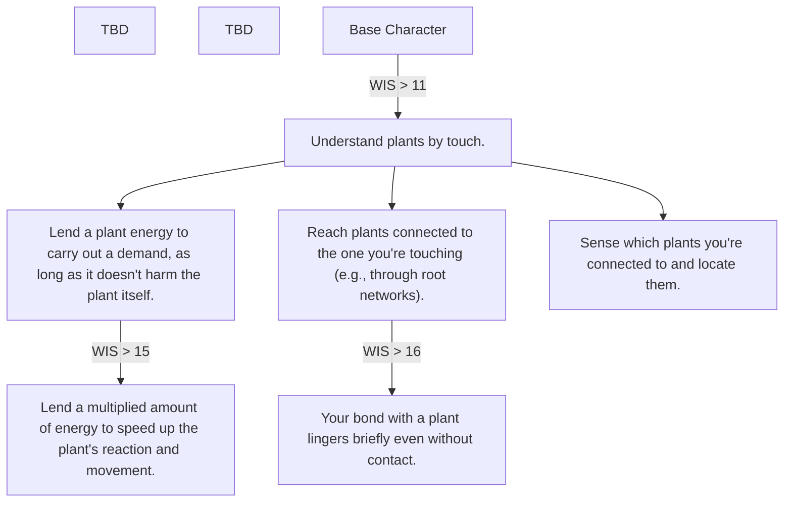
```mermaid
flowchart TD

A[Base Character]

1["Understand plants by touch."]
2["Lend a plant energy to carry out a demand, as long as it doesn't harm the plant itself."]
3["Reach plants connected to the one you're touching (e.g., through root networks)."]
4["Sense which plants you're connected to and locate them."]
5["Lend a multiplied amount of energy to speed up the plant's reaction and movement."]
6["TBD"]
7["Your bond with a plant lingers briefly even without contact."]
8["TBD"]

A --> |WIS > 11|1

1 --> 2 --> |WIS > 15|5
1 --> 3 --> |WIS > 16|7
1 --> 4

```

### Druid · Earth/Life
*Life is not a possession — it is a current, flowing through every breathing thing, and you have learned to feel its pulse beneath your palm. To heal is to steady that current; to draw from it is to borrow against something no creature freely gives away. This is the oldest and most dangerous of the Druid's gifts, for the line between mending and taking is thinner than most who walk it ever admit.*

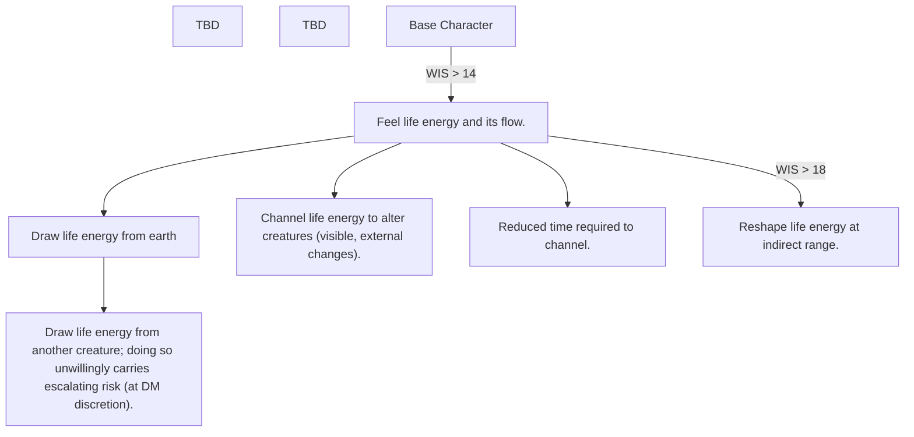
```mermaid
flowchart TD

A[Base Character]

1["Feel life energy and its flow."]
2["Draw life energy from earth"]
3["Draw life energy from another creature; doing so unwillingly carries escalating risk (at DM discretion)."]
4["Channel life energy to alter creatures (visible, external changes)."]
5["TBD"]
6["Reduced time required to channel."]
7["TBD"]
8["Reshape life energy at indirect range."]

A -->|WIS > 14|1 --> 2 --> 3
1 --> 4 
1 --> 6
1 --> |WIS > 18|8

```

### Druid · Nature Spirits
*Before there were gods with names and temples, there were presences in the wood that noticed when you passed through uninvited. You have learned to notice them back — first as a feeling of being watched, later as voices with opinions, favors, and grudges of their own. They are not servants and never will be; they are neighbors older than memory, and a wise Druid treats every favor earned as a debt eventually owed.*

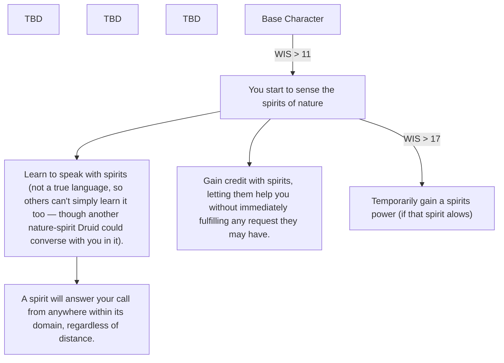
```mermaid
flowchart TD

A[Base Character]

1["You start to sense the spirits of nature"]
2["Learn to speak with spirits (not a true language, so others can't simply learn it too — though another nature-spirit Druid could converse with you in it)."]
3["Gain credit with spirits, letting them help you without immediately fulfilling any request they may have."]
4["TBD"]
5["Temporarily gain a spirits power (if that spirit alows)"]
6["TBD"]
7["TBD"]
8["A spirit will answer your call from anywhere within its domain, regardless of distance."]

A -->|WIS > 11|1 --> 2 --> 8
1 --> 3
1 --> |WIS > 17|5


```

---

## Elementalist

*Fire, water, earth, and air answer to the same principle, worn in four different shapes: mass, complexity, reach, and resistance. You do not conjure the elements from nothing — you convince what is already there to move, burn, flow, or hold in the shape your will describes. The four paths below are less separate disciplines than four dialects of the same argument with the world.*

### Elementalist · Fire
*Fire has always wanted to spread — you have simply learned to ask it where. What begins as a candle's flicker under your fingertip grows, with study, into a blaze that recognizes you as kin and spares you its hunger. Others fear what burns; you have made peace with it, on the condition that it remembers, always, whose fire it is.*

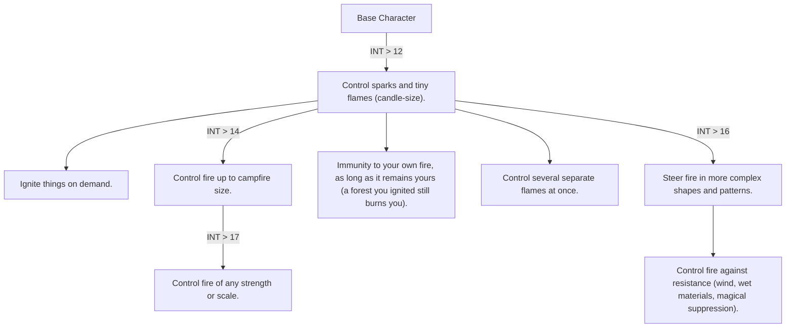
```mermaid
flowchart TD

A[Base Character]

1["Control sparks and tiny flames (candle-size)."]
2["Ignite things on demand."]
3["Control fire up to campfire size."]
4["Immunity to your own fire, as long as it remains yours (a forest you ignited still burns you)."]
5["Control several separate flames at once."]
6["Steer fire in more complex shapes and patterns."]
7["Control fire against resistance (wind, wet materials, magical suppression)."]
8["Control fire of any strength or scale."]

A --> |INT > 12|1 
1 --> 2 
1 --> |INT > 14|3 --> |INT > 17|8
1 --> 4
1 --> 5
1 --> |INT > 16|6 --> 7
```

### Elementalist · Water
*Water does not fight — it finds the way around, beneath, or through, patient and relentless in equal measure. You have learned to be that patience made purposeful: currents that answer your intent, floods that rise where you point, mist that gathers because you willed it to. Stone breaks. Water simply continues, and so, increasingly, do you.*

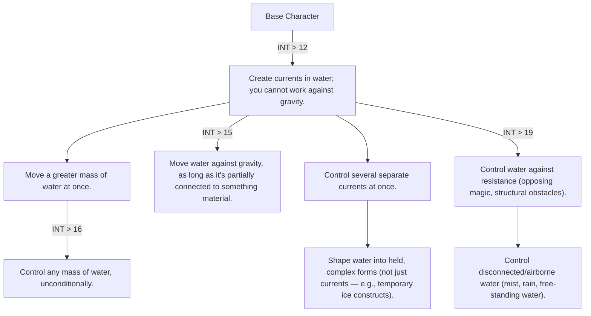
```mermaid
flowchart TD

A[Base Character]

1["Create currents in water; you cannot work against gravity."]
2["Move a greater mass of water at once."]
3["Move water against gravity, as long as it's partially connected to something material."]
4["Control several separate currents at once."]
5["Shape water into held, complex forms (not just currents — e.g., temporary ice constructs)."]
6["Control water against resistance (opposing magic, structural obstacles)."]
7["Control disconnected/airborne water (mist, rain, free-standing water)."]
8["Control any mass of water, unconditionally."]

A --> |INT > 12|1 
1 --> 2 --> |INT > 16|8
1 --> |INT > 15|3
1 --> 4 --> 5
1 --> |INT > 19| 6 --> 7
```

### Elementalist · Earth
*The ground does not move quickly, but it moves absolutely when it finally does. You are the one who convinces stone and soil that stillness was only ever a habit, not a law — raising walls from bare earth, shaking foundations with a thought, and eventually feeling the whole world tremble beneath you like an extension of your own skin.*

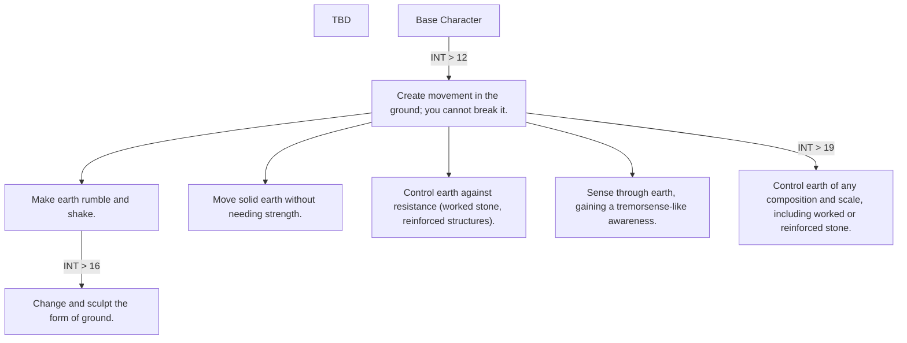
```mermaid
flowchart TD

A[Base Character]

1["Create movement in the ground; you cannot break it."]
2["Make earth rumble and shake."]
3["Move solid earth without needing strength."]
4["Change and sculpt the form of ground."]
5["TBD"]
6["Control earth against resistance (worked stone, reinforced structures)."]
7["Sense through earth, gaining a tremorsense-like awareness."]
8["Control earth of any composition and scale, including worked or reinforced stone."]

A --> |INT > 12|1
1 --> 2 --> |INT > 16|4
1 --> 3
1 --> 6
1 --> 7
1 --> |INT > 19|8
```

### Elementalist · Air
*Nobody notices the wind until it chooses to matter. You are the reason it chooses — a breath that turns into a gust, a gust that turns into a gale precise enough to snuff a single candle across a room or knock a single man off his feet. Air asks for nothing and holds nothing back; it simply goes where you tell it, faster than anyone expects.*

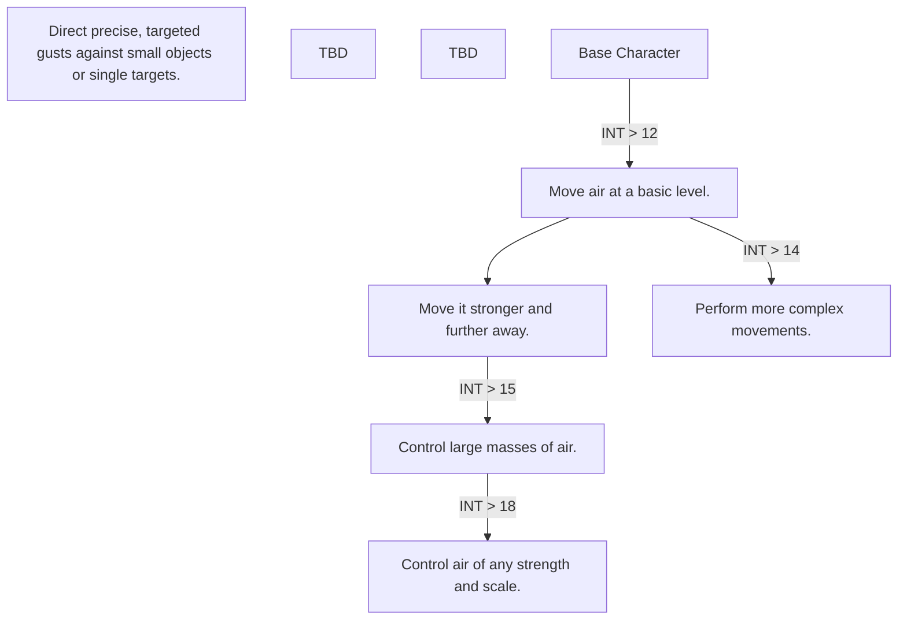
```mermaid
flowchart TD

A[Base Character]

1["Move air at a basic level."]
2["Move it stronger and further away."]
3["Perform more complex movements."]
4["Control large masses of air."]
5["Direct precise, targeted gusts against small objects or single targets."]
6["TBD"]
7["TBD"]
8["Control air of any strength and scale."]

A --> |INT > 12|1 
1 --> 2 -->|INT > 15| 4 -->|INT > 18| 8
1 --> |INT > 14|3
```

---

## Fighter

*Every warrior burns something to fight harder — breath, focus, fear turned inside out. You call it adrenaline: the body's oldest magic.*

### Fighter · Barbarian (STR)
*Rage is not a loss of control — it is a different kind of control, one that trades precision for certainty. Something in you answers pain and violence not with retreat but with more of the same, building until it must be spent. You do not fight to survive the moment. You fight because the moment has finally given you a reason to stop holding back.*

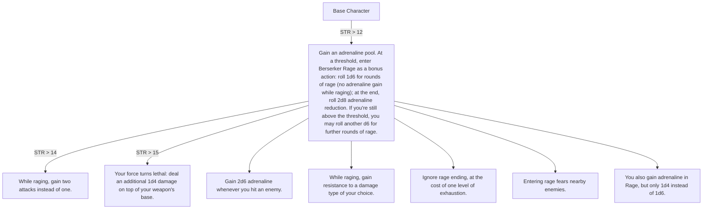
```mermaid
flowchart TD

A[Base Character]

1["Gain an adrenaline pool. At a threshold, enter Berserker Rage as a bonus action: roll 1d6 for rounds of rage (no adrenaline gain while raging); at the end, roll 2d8 adrenaline reduction. If you're still above the threshold, you may roll another d6 for further rounds of rage."]
2["While raging, gain two attacks instead of one."]
3["Your force turns lethal: deal an additional 1d4 damage on top of your weapon's base."]
4["Gain 2d6 adrenaline whenever you hit an enemy."]
5["While raging, gain resistance to a damage type of your choice."]
6["Ignore rage ending, at the cost of one level of exhaustion."]
7["Entering rage fears nearby enemies."]
8["You also gain adrenaline in Rage, but only 1d4 instead of 1d6."]

A --> |STR > 12|1
1 -->|STR > 14| 2
1 -->|STR > 15| 3
1 --> 4
1 --> 5
1 --> 6
1 --> 7
1 --> 8
```

### Fighter · Duelist (DEX)
*A blade fight is a conversation held at speed, and you have learned to listen to your own body's rising pulse as closely as your opponent's footwork.*

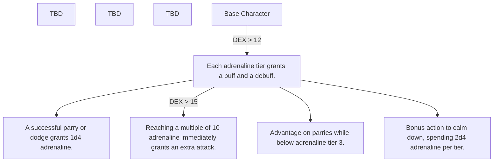
```mermaid
flowchart TD

A[Base Character]

1["Each adrenaline tier grants a buff and a debuff."]
2["A successful parry or dodge grants 1d4 adrenaline."]
3["Reaching a multiple of 10 adrenaline immediately grants an extra attack."]
4["Advantage on parries while below adrenaline tier 3."]
5["Bonus action to calm down, spending 2d4 adrenaline per tier."]
6["TBD"]
7["TBD"]
8["TBD"]

A --> |DEX > 12|1
1 --> 2
1 -->|DEX > 15| 3
1 --> 4
1 --> 5
```

|Tier |Adrenalin | Effect|
|-|-|-|
1 | 0 - 9 | no effect
2 | 10 - 19 | you become more precise
3 | 20 - 29 | your calmety lowers, you become less precise, but your hits gain strength: +x Damage
... | ...

### Fighter · Knight (CON)
*Some warriors fight to win. You fight to make sure everyone beside you gets to keep fighting too. Every blow you take, every hit you turn aside for someone who couldn't, builds a steadiness in you that has nothing to do with anger and everything to do with resolve. The line holds because you decided, a long time ago, that it would.*

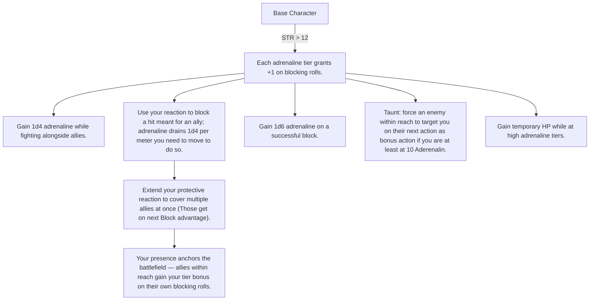
```mermaid
flowchart TD

A[Base Character]

1["Each adrenaline tier grants +1 on blocking rolls."]
2["Gain 1d4 adrenaline while fighting alongside allies."]
3["Use your reaction to block a hit meant for an ally; adrenaline drains 1d4 per meter you need to move to do so."]
4["Gain 1d6 adrenaline on a successful block."]
5["Taunt: force an enemy within reach to target you on their next action as bonus action if you are at least at 10 Aderenalin."]
6["Extend your protective reaction to cover multiple allies at once (Those get on next Block advantage)."]
7["Gain temporary HP while at high adrenaline tiers."]
8["Your presence anchors the battlefield — allies within reach gain your tier bonus on their own blocking rolls."]

A --> |STR > 12|1
1 --> 2
1 --> 3 --> 6 --> 8
1 --> 4
1 --> 5
1 --> 7

```

---

## Light Mage

*Light does not belong to you, and it never will — it belongs to the sun, the moon, and whatever source you happen to be standing beneath. Cut off from that source, you are only as strong as anyone else in the dark. But given light, even a little, you become something the dark has learned to fear.*

### Light Mage · Sun-Worker
*The sun asks nothing in return for its warmth, and you have learned to shape that gift into something with an edge. Your weapon is light given form and purpose, reforged in ritual beneath open sky, burning steady and honest in a way that shadow-born magic never quite manages. There is no trickery in what you do — only brilliance, focused.*

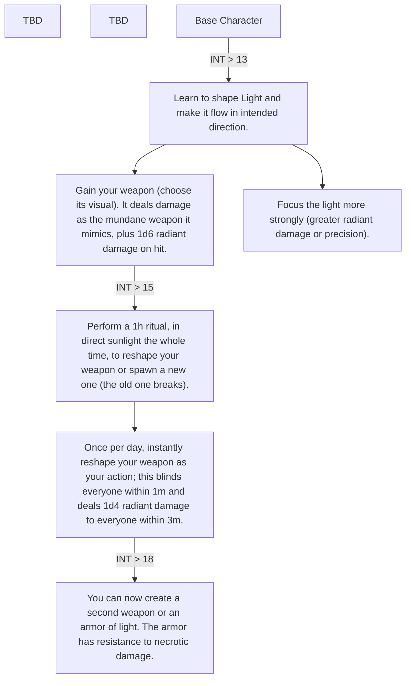
```mermaid
flowchart TD

A[Base Character]

1["Learn to shape Light and make it flow in intended direction."]
2["Gain your weapon (choose its visual). It deals damage as the mundane weapon it mimics, plus 1d6 radiant damage on hit."]
3["Perform a 1h ritual, in direct sunlight the whole time, to reshape your weapon or spawn a new one (the old one breaks)."]
4["Focus the light more strongly (greater radiant damage or precision)."]
5["TBD"]
6["Once per day, instantly reshape your weapon as your action; this blinds everyone within 1m and deals 1d4 radiant damage to everyone within 3m."]
7["You can now create a second weapon or an armor of light. The armor has resistance to necrotic damage."]
8["TBD"]

A-->|INT > 13|1
1 --> 2 --> |INT > 15|3 --> 6 --> |INT > 18|7
1 --> 4

```

### Light Mage · Moon-Worker
*The moon is not the sun's lesser reflection — it is its own thing entirely, changeable, patient, and just a little unkind to those who cross it. You have learned to work with that change rather than against it, shaping a weapon whose nature shifts with the sky itself. Where the Sun-Worker is a steady flame, you are a phase — sometimes radiant, sometimes something closer to shadow wearing light's shape.*

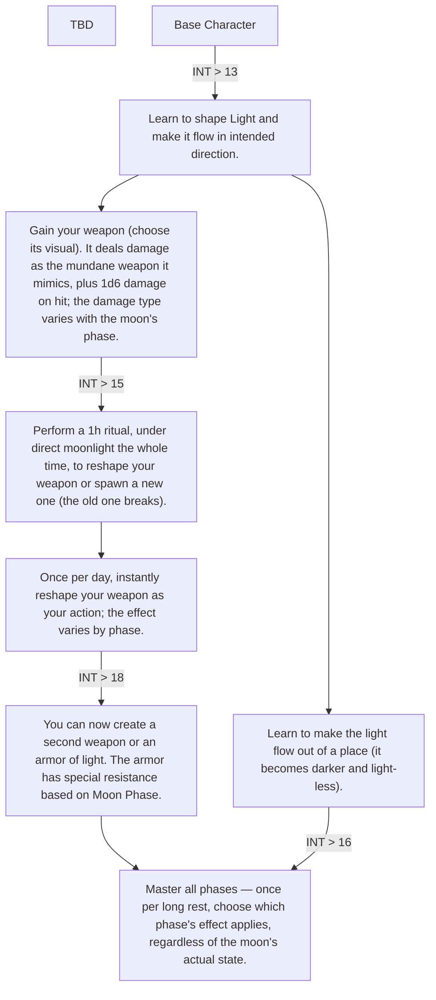
```mermaid
flowchart TD

A[Base Character]

1["Learn to shape Light and make it flow in intended direction."]
2["Gain your weapon (choose its visual). It deals damage as the mundane weapon it mimics, plus 1d6 damage on hit; the damage type varies with the moon's phase."]
3["Perform a 1h ritual, under direct moonlight the whole time, to reshape your weapon or spawn a new one (the old one breaks)."]
4["Learn to make the light flow out of a place (it becomes darker and light-less)."]
5["Once per day, instantly reshape your weapon as your action; the effect varies by phase."]
6["TBD"]
7["You can now create a second weapon or an armor of light. The armor has special resistance based on Moon Phase."]
8["Master all phases — once per long rest, choose which phase's effect applies, regardless of the moon's actual state."]

A-->|INT > 13|1
1 --> 2 --> |INT > 15|3 --> 5 --> |INT > 18|7 --> 8
1 --> 4 -->|INT > 16| 8
```

#### Moon Phases

| Phase | Damage | Damage Type | Reshape Effect|
|--|-|--|-|
| Full moon |High| Radiant Damage | same as sun
new moon | Low | Necrotic damage | it is emerging darkness making surroundings in 2m 2 stages darker and in 5m 1. Inside this cloud you can see like one step brighter.
| 50/50 | Mid | Radiant Damage | you emerge light and shadow the same making no difference. If an Enemy is in your weapons reach after the rit you can use your Bonus action to attack

---

## Mirage

*Nothing you make is real, and that has never once stopped it from hurting someone. You are an architect of belief, building illusions so convincing that the line between seeing and knowing simply stops mattering to the mind you're speaking to.*

### Mirage · Mind Reader
*Every person carries a fear and a want close enough to the surface that a careful glance can find it. You have learned to read that surface and hand it back to them, twisted into something they cannot look away from. It is not mind control — it is worse. It is showing someone exactly what they were already afraid of, or already wanted, and letting their own mind do the rest.*

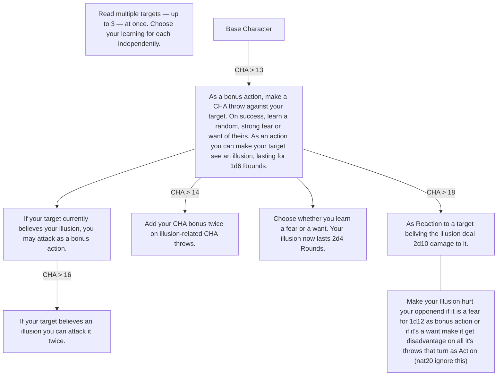
```mermaid
flowchart TD

A[Base Character]

1["As a bonus action, make a CHA throw against your target. On success, learn a random, strong fear or want of theirs. As an action you can make your target see an illusion, lasting for 1d6 Rounds."]
2["If your target currently believes your illusion, you may attack as a bonus action."]
3["Add your CHA bonus twice on illusion-related CHA throws."]
4["Choose whether you learn a fear or a want. Your illusion now lasts 2d4 Rounds."]
5["Read multiple targets — up to 3 — at once. Choose your learning for each independently."]
6["If your target believes an illusion you can attack it twice."]
7["As Reaction to a target beliving the illusion deal 2d10 damage to it."]
8["Make your Illusion hurt your opponend if it is a fear for 1d12 as bonus action or if it's a want make it get disadvantage on all it's throws that turn as Action (nat20 ignore this)"]

A --> |CHA > 13|1
1 --> 2 -->|CHA > 16| 6
1 --> |CHA > 14|3
1 --> 4
1 --> |CHA > 18| 7 --- 8
```

### Mirage · Fata Morgana
*The world lies to itself all the time — a mirage on the horizon, a trick of heat and light that fools even careful eyes. You have learned to author those lies on purpose, bending light until the ground cracks that was never cracked, until a wall stands that was never built. You cannot make a bird fly or a beast attack; you can only make the world around them look different than it is — which, against the right mind, is more than enough.*

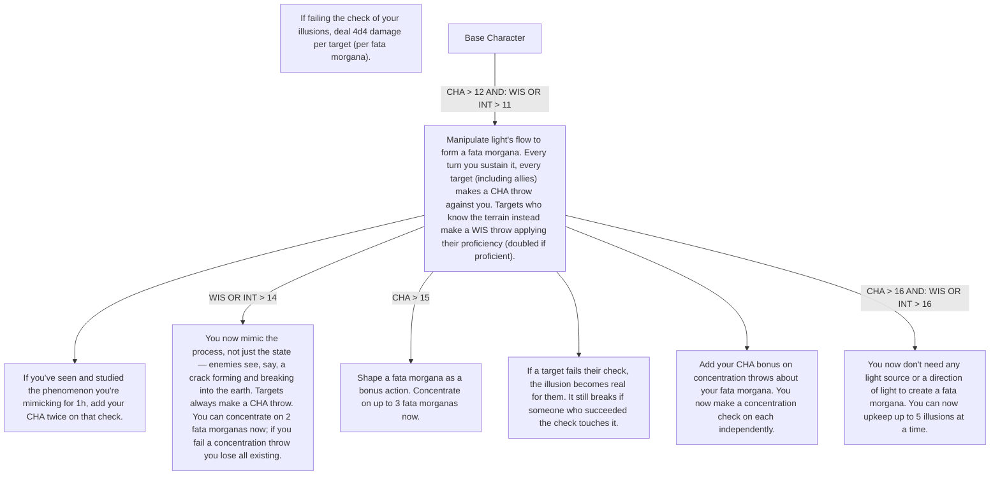
```mermaid
flowchart TD

A[Base Character]

1["Manipulate light's flow to form a fata morgana. Every turn you sustain it, every target (including allies) makes a CHA throw against you. Targets who know the terrain instead make a WIS throw applying their proficiency (doubled if proficient)."]
2["If you've seen and studied the phenomenon you're mimicking for 1h, add your CHA twice on that check."]
3["You now mimic the process, not just the state — enemies see, say, a crack forming and breaking into the earth. Targets always make a CHA throw. You can concentrate on 2 fata morganas now; if you fail a concentration throw you lose all existing."]
4["If a target fails their check, the illusion becomes real for them. It still breaks if someone who succeeded the check touches it."]
5["Shape a fata morgana as a bonus action. Concentrate on up to 3 fata morganas now."]
6["Add your CHA bonus on concentration throws about your fata morgana. You now make a concentration check on each independently."]
7["If failing the check of your illusions, deal 4d4 damage per target (per fata morgana)."]
8["You now don't need any light source or a direction of light to create a fata morgana. You can now upkeep up to 5 illusions at a time."]

A -->|CHA > 12 AND: WIS OR INT > 11|1
1 --> 2
1 --> |WIS OR INT > 14|3
1 --> |CHA > 15|5
1 --> 4
1 --> 6
1 --> |CHA > 16 AND: WIS OR INT > 16|8
```

---

## Necromancer

*Death is not an ending you fear — it is a resource you understand better than most of the living ever will. Two paths: one that spends the caster's own vitality as currency, one that commands what vitality has already left behind.*

### Necromancer · Blood
*Every spell has a price, and you have simply chosen to pay it yourself, in the oldest coin there is. A cut, a toll, a sacrifice — your own blood spent to push your magic further than it would otherwise reach. Others fear the cost. You have made peace with it, because you were always going to be the one paying either way.*

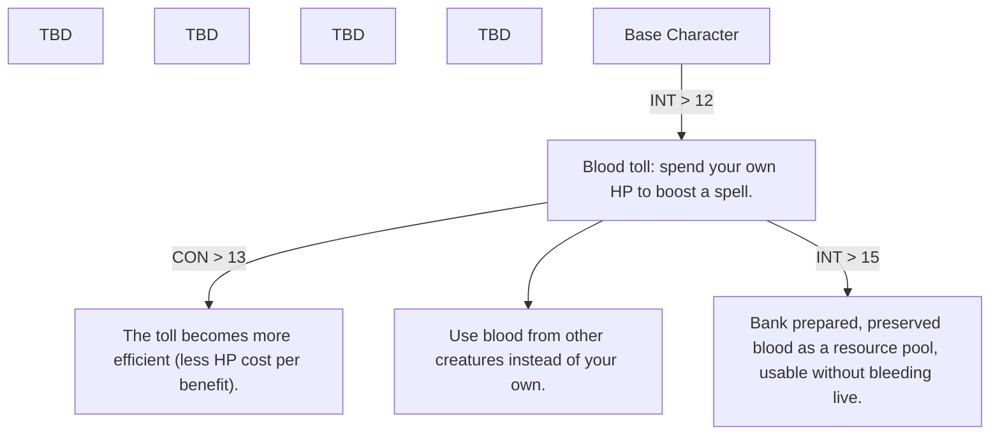
```mermaid
flowchart TD

A[Base Character]

1["Blood toll: spend your own HP to boost a spell."]
2["The toll becomes more efficient (less HP cost per benefit)."]
3["TBD"]
4["Use blood from other creatures instead of your own."]
5["TBD"]
6["TBD"]
7["TBD"]
8["Bank prepared, preserved blood as a resource pool, usable without bleeding live."]

A --> |INT > 12|1
1 --> |CON > 13|2
1 --> 4
1 --> |INT > 15|8

```

### Necromancer · Death
*A corpse is not nothing — it is a vessel that stopped being used, and you have learned to put it back to work. Quality matters as much as quantity: a fresh, strong body answers your command with more strength than a decade-old bone, but given time and skill, you can raise a small army from what everyone else considers simply gone.*

```mermaid
flowchart TD

A[Base Character]

1["Empower corpses and command them."]
2["Empower more corpses simultaneously."]
3["Awaken and command as a bonus action."]
4["Higher-quality corpses yield noticeably stronger servants."]
5["Servants gain resistances based on the quality of their corpse."]
6["TBD"]
7["TBD"]
8["Raise an elite servant from an exceptional corpse, distinctly more capable than your standard minions."]

A --> |INT > 12|1 --> 4 --> |INT > 17|8
1 --> 2
1 --> |INT > 15|3
```

---

## Part L — Sorcerer

### Sorcerer · Channeler
*Magic was never meant to be tame, and you have never quite managed to fully leash it. Every spell you cast is a negotiation with forces that don't much care what you intended — sometimes they cooperate exactly, sometimes they overshoot wildly, and sometimes the difference between the two is the most interesting thing that happens all fight. You do not control wild magic. You survive it, more skillfully each time.*

```mermaid
flowchart TD

A[Base Character]

1["Cast spells, but there may be side effects (the DM improvises, or uses the table below)."]
2["Reroll a side-effect roll."]
3["Roll a second side-effect roll if you wish."]
4["TBD"]
5["Reduce the range of the worst outcomes (still random, but the floor is raised)."]
6["Recognize a side effect before it resolves, and choose to accept it or attempt to suppress it. (d20 + CHA-Mod > 15)"]
7["Cast two spells in sequence sharing a single side-effect roll."]
8["Let a deviation run fully wild by choice — highest risk, highest possible reward, full narrative license to the DM."]

A --> |CHA > 11|1
1 --> |CHA > 13|2 --> 5 --> |CHA > 15|6
1 --> 3 --> |CHA > 14| 8
```

---

## Summoner

*A demon's true name is a key, and finding it is only the first danger. Binding one is a negotiation held at the edge of a blade; keeping it bound is a discipline that never fully ends. Two paths: command many weak servants, or dominate one terrible one.*

```mermaid
flowchart TD

A[Base Character]

1["Learn 3 rituals for 3 base demons."]
2["Your bind check improves: 2d10 instead of 1d20."]
3["No hard cap on the number of bound demons, but each additional demon adds 1d4 difficulty to the check."]
4["Add your INT-Mod twice to the bind/controll check."]
5["If you controll no other demons your controll and bindchecks become 3d8"]
6["Demeons under Tier 3 suffer disadvantage on your binding checks"]
7["TBD"]
8["If your bind check was 10 higher than your demons escape check they do not vanish after they did their task."]

A -->|INT > 11|1
1 --> |INT > 14|2 --> 4 --> 5 --> |INT > 17|6 --> 8
1 --> 3
```

---

## Warlock
*You made a bargain, and bargains have a way of reshaping the one who makes them. Your patron — fiend, fey, or something with no comfortable name at all — grants power in exchange for a devotion that only deepens with time. Every prayer answered is a debt quietly renewed, and every gift given comes wearing its patron's fingerprints, whether you notice them or not.*

```mermaid
flowchart TD

A[Base Character]

1["Gain your pact (choose a patron)."]
2["Pray to your patron for a minor power buff until your next long rest."]
3["Gain a patron-specific minor trait, reflecting your patron's theme."]
4["Gain a pact weapon."]
5["TBD"]
6["Gain a stronger patron-specific ability, or bind a second patron."]
7["Gain the power to reshape your pact weapon in a one hour ritual."]
8["Your patron grants you a signature, iconic ability tied directly to its core theme."]

A --> |WIS > 11|1
1 --> 2
1 --> |WIS > 13|3 --> 6
1 --> |WIS > 14|4 --> 7
1 --> |WIS > 17|8
```

---

## Witch

*A Witch's power is old, personal, and built on knowing things others don't — a true name, a stolen strand of hair, the exact shape of a grudge. Four paths, one instinct: the world can be bent, if you know precisely where to press.*

### Witch · Curses & Witchcraft
*A curse spoken at a stranger is a threat. A curse spoken by name, over something they once owned, with their face fixed in your memory — that is a promise. You have learned that misfortune is not random; it can be aimed, layered, and made to land exactly where you intend, and the more of a person you hold in your grasp, the less that person's luck belongs to them at all.*

```mermaid
flowchart TD

A[Base Character]

1["Curse a target on sight (weakest tier)."]
2["Curse a target by name, without needing sight. If you have both: moderate curse tier."]
3["Curse a target using something they own. If you have any two things: moderate curse tier, or if all three, strongest curse tier."]
4["You can now resolve your curses at will."]
5["Curse items directly."]
6["If the target does not expect to get cursed, you win the curse-check."]
7["You can now call a trigger for a curse."]
8["You can now cast 3rd level curses on having only 2 aspects, and 2nd level curses by only having 1."]

A --> |INT > 12|1
A --> |INT > 12|2
A --> |INT > 12|3
1 --- 4
2 --- 4
3 --- 4
1 --- |INT > 13|5
2 --- |INT > 13|5
3 --- |INT > 13|5
1 --- |INT > 15|6
2 --- |INT > 15|6
3 --- |INT > 15|6
1 --- 7
2 --- 7
3 --- 7
1 --> |INT > 15|8
2 --> |INT > 15|8
3 --> |INT > 15|8
```

### Witch · Brewing
*Every plant, root, and rare ingredient holds a secret it's willing to give up to someone patient enough to ask correctly. You are a keeper of recipes half-remembered and half-discovered — potions that heal, harm, hinder, or help, bottled from patience and precision in equal measure. A cauldron does not lie, if you know how to read what it tells you.*

```mermaid
flowchart TD

A[Base Character]

1["Brew potions (basic recipes: heal, buff, debuff, damage)."]
2["Sense the location of a chosen ingredient up to three times per long rest."]
3["Merge different potions into one."]
4["Once per long rest you can detect any potion's effect at a 100% chance."]
5["Brew stronger tiers of recipes you already know."]
6["If you see a brewed potion and you learn its effects, you can do a WIS throw to guess its ingredients."]
7["You can brew double the amount out of the same amount of essentials."]
8["TBD"]

A --> |INT > 12|1
1 --> 2
1 --> |INT > 14|3
1 --> |INT > 15|4 --> 6
1 --> |INT > 14|5 --> 7
```

### Witch · Familiar
*A familiar is not a pet, and it was never meant to be decorative. Bound to you by something closer to kinship than command, it fights at your side, watches when you cannot, and feels what you feel across a distance neither of you fully understands. Lose it, and you lose part of yourself. Most Witches would tell you that risk was always the point.*

```mermaid
flowchart TD

A[Base Character]

1["Gain a familiar; you both sense each other's strong feelings (pain, great joy)."]
2["Communicate by telepathy."]
3["Gain 3 spells from your familiar's spell list. Your familiar has 4/3 your Passive perception. Enemies get Disadvantage on sneak and stealth against your familiar (everyone else gets first throw values)."]
4["Your familiar can fight competently on its own."]
5["Your familiar gains improved combat capability (better attacks/defenses)."]
6["Your familiar becomes a true extension of yourself — share senses fully, or briefly perceive through it at range."]
7["If your familiar is about to die, you can sacrifice half your remaining HP to immediately revive it at 1/4 of its health."]
8["TBD"]

A --> |CHA > 11|1
1 --> 2
1 --> 3
1 --> 4
1 --> 5
1 -->|CHA > 13| 6
1 --> |CHA > 14|7
```

### Witch · Fate & Foresight
*The future is not fixed, but it leans — and you have learned to feel which way. A glimpse here, a nudge there: not command over fate, but a whispered suggestion to a world that mostly listens. You do not force outcomes. You simply learn, a little before anyone else, which way they were already about to fall — and sometimes, that's enough to matter.*

```mermaid
flowchart TD

A[Base Character]

1["Once per long rest, make a diviner's throw to glimpse the future."]
2["Choose who or what your divination concerns."]
3["Divine once per short rest."]
4["Choose a specific roll for a chosen entity to increase or decrease by 1d6 when it happens."]
5["With a divinatory item, divine on up to 3 different targets, including yourself."]
6["For each target: reduce the chance it is a debuff or buff."]
7["Your calls become more reliable, the roll is now modified by 2d6."]
8["Divine a pivotal moment for an entity with full precision — name the exact circumstance, not just a general shift in fortune. Your DM decides how often you can do this."]

A --> |CHA or WIS > 12|1
1 --> 2 --> |CHA or WIS > 14|4 --> 6 --> |CHA or WIS > 16|7
1 --> 3 --> 5
5 --> 8
7 --> 8
```