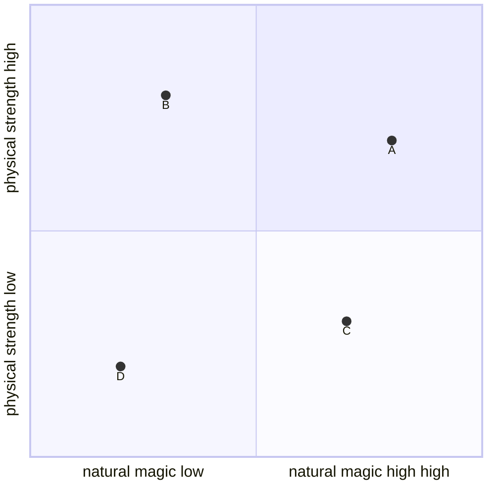

> This is about how the scale actually sorts out, without a concrete scale.

If you think about how mighty a creature is naturally you think about 2 things mainly: Size and Experience/Lifestyle. In a fantasy setting you also have the magic a creature can cast normally.

So we got kind of coordinate system to place all the beings:

Now you can sort the creatures to the grid. 

So may notice a dragon is naturally stronger than a human, as it is bigger and most of the time it got magical features.

This about the natural position on the power scale.

But what is stronger: Magic or Physical? That's not clear to answer, bacause magic is so a far spreaded term. 

# Now let's sort a little:
## Humans

Humans are as always our base. Humans do not feature a single magic abillity natural. So the become [0, 0.333]. 

## Non-magics

### non-fictional

There is no animal (beast) able to cast any magic, so they all are [0, y]. This `y` now differs from really weak (like a mouse) to quite strong like a bear or a bison. As Animals are already the strongest non-fictonal beeings they get $y = 0.666$

### Fictional

Of course there are much stronger beings than a bear. The strongest is the tarresque $y = 1$

## Magics

There are many different types of magic and to just rank illusion magic against pyromancy is quite hard. So this power scale does not feature the real strength or lethality of the being - like it is not on toxic animals, who could kill even on low strength - but on how strong and how many types of magic they can cast without studying.

The strongest for this would be dragons $y = 1$. Also a dragon is stronger than a bear. So may make it reach 0.9 in strength

Many magic beings like wizards need to actually study, so they do not own magic by default, so they are not listed separate from their race, even if they would be stronger.

## Playable Races

Many playable races like dwarfs do not feature any magic, but they are a little stronger than humans. But there also are magical races like elves. Those do feature a lot on magic, but they do a little - Enough to port themself or heal.

# Magic vs. Physicals

This is the most hardest challenge to map. Is magic exactly as dangerous as power? Of course this is an abstract system not checking on the actual spells. This is just about the potential. So say your danger potential can be 0 to 100. Now i would say the physical and magical danger potential are worth the same, so max is 50 danger from both even if the stats themself reach up to 100: 

$$\text{Danger Potential} = \frac{Magic Danger potential + Physical Danger potential}{2}$$

But danger is not just a flat value. Let's say you magical potential is 70, so you reach 70% of max power. This means you may would loose to someone who reaches 80%, but for a dummy it does not really matter. 

So for potential to thread you could say its:

$$\text{Thread} = 10\times\sqrt{\text{Potential}}$$

or maybe it's:

$$\text{Thread} = 35\times log_5\text{Potential}$$

You also got not only the threads of the strength, but also about the toxicity. This would be similar, maybe 40:40:20, not sure yet.

So this is about how dangerous a creature is if it just hits. Of course this is not realistic. The strategy and the potential it hits you is really important. So a really slow strong creature can be really unthreating, if it faces a really fast enemy and just not hit. Of course that dex creature could be one hit, but `why wearing an armor, if you are not hitted`. 

So a creature needs 4 Stats for CR:

- Speed
- Force
- Magic Potential
- Toxicity (featuring potential infections they could carry)

So that's the offensive thread, but getting no damage makes a creature also quite threating. But as this is really enemy-relied, it is not featured in any guide in the game world, so why should it in theese?

