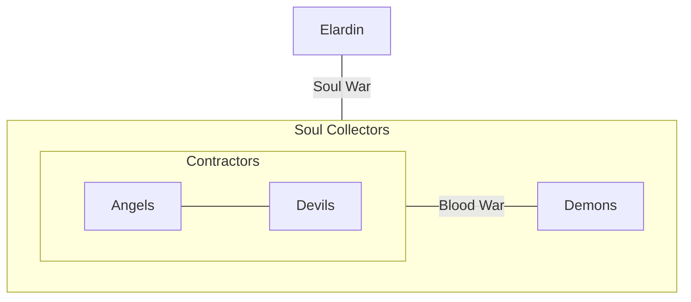

As you can imagine there are many conflicts in a so divers society like demons got it.

The fractions of devils, demons, eladrin and celestials are alway in confict and war.

The Blood War known from DnD is in this homebrew not only between Devils and Semons but between both contractors and the demons. But in fact the devils are the real fighters, especially because of the location:

$$\text{Nine Hells} \in \text{Abyss}$$

The Angels instead focus on extending their cult. This of course causes tension between devils and celestials resulting in quite heavy fights about even minor souls.

And at top level there is the soul war between soul gatherer and soul releasers. 

### Alliances
In those wars you actually sometimes face an alliance.
So the eladrin often join fractions on battles, but they other dractions never like that as eladrin try to kill them after fight as well to make the souls really reach realm of the death.