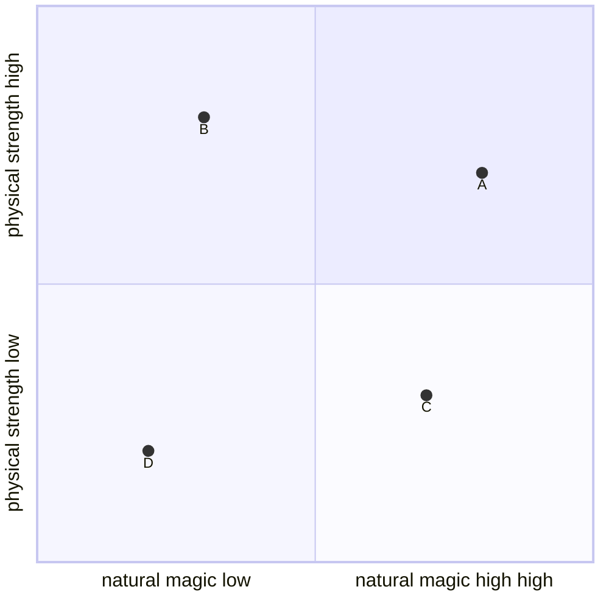

> This is about how the scale actually sorts out, without a concrete scale.

If you think about how mighty a creature is naturally you think about 2 things mainly: Size and Experience/Lifestyle. In a fantasy setting you also have the magic a creature can cast normally.

So we got kind of coordinate system to place all the beings:

Now you can sort the creatures to the grid. 

So may notice a dragon is naturally stronger than a human, as it is bigger and most of the time it got magical features.

